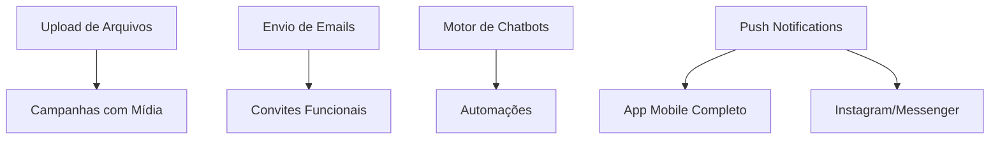

# Plano de Implementação - V4 Connect CRM

> Documento gerado em: 2025-12-02
> Versão: 1.0

## Visão Geral

Este documento detalha o plano de implementação para as 10 features pendentes do V4 Connect CRM, organizadas por prioridade e estimativa de esforço.

| # | Feature | Prioridade | Esforço | Status |
|---|---------|------------|---------|--------|
| 1 | Motor de Execução de Chatbots | Alta | 16-20h | Pendente |
| 2 | Envio de Campanhas | Alta | 8-12h | Parcial |
| 3 | Upload de Arquivos | Alta | 4-6h | Parcial |
| 4 | Envio de Emails (Convites) | Alta | 4-6h | Pendente |
| 5 | Instagram/Messenger | Média | 6-8h | Parcial |
| 6 | App Mobile | Média | 12-16h | Parcial |
| 7 | Automações/Triggers | Média | 12-16h | Pendente |
| 8 | Cobertura de Testes | Baixa | 8-12h | Parcial |
| 9 | Analytics Avançado | Baixa | 8-12h | Parcial |
| 10 | Documentação | Baixa | 6-8h | Parcial |

**Total Estimado: 84-116 horas**

---

## 1. Motor de Execução de Chatbots

### Estado Atual
- ✅ Schema de banco (chatbots, flowNodes, flowEdges)
- ✅ API CRUD completa para chatbots
- ✅ UI do builder com ReactFlow
- ✅ 6 tipos de nós (start, message, condition, action, delay, end)
- ❌ Engine de execução não implementado
- ❌ Triggers não funcionais

### Arquivos Existentes
```
packages/database/src/schema/chatbots.ts
apps/api/src/routes/chatbots.ts
apps/api/src/services/chatbots.service.ts
apps/web/src/components/chatbot-builder/
apps/worker/src/queues/ai-queue.ts (ChatbotJob parcial)
```

### Implementação Necessária

#### 1.1 Criar Serviço de Execução de Fluxo
**Arquivo:** `apps/api/src/services/chatbot-executor.service.ts`

```typescript
interface ExecutionContext {
  chatbotId: string;
  conversationId: string;
  contactId: string;
  currentNodeId: string;
  variables: Record<string, any>;
  messageHistory: Message[];
}

// Métodos necessários:
- startExecution(chatbotId, conversationId, triggerMessage)
- executeNode(context, node)
- evaluateCondition(context, condition)
- handleMessageNode(context, config)
- handleConditionNode(context, config)
- handleActionNode(context, config)
- handleDelayNode(context, config)
- findNextNode(context, currentNode)
- saveExecutionState(context)
- loadExecutionState(conversationId)
```

#### 1.2 Implementar Handlers por Tipo de Nó

| Tipo | Ação |
|------|------|
| `start` | Inicializa contexto, avança para próximo nó |
| `message` | Envia mensagem via Evolution/Meta API |
| `condition` | Avalia expressão, escolhe edge baseado em resultado |
| `action` | Executa ação (tag, assign, webhook, set variable) |
| `delay` | Agenda job para continuar após X tempo |
| `end` | Finaliza fluxo, limpa estado |

#### 1.3 Integrar com Webhook de Mensagens
**Arquivo:** `apps/api/src/routes/webhooks.ts` (linha ~460)

```typescript
// Após salvar mensagem, verificar triggers de chatbot
const activeChatbots = await chatbotsService.findByChannel(channel.id);
for (const chatbot of activeChatbots) {
  if (shouldTrigger(chatbot, message)) {
    await chatbotExecutor.startExecution(chatbot.id, conversation.id, message);
  }
}
```

#### 1.4 Implementar Tipos de Trigger
- **keyword**: Verificar se mensagem contém palavra-chave
- **always**: Disparar para toda mensagem nova
- **schedule**: Cron job para disparar em horários

#### 1.5 Persistência de Estado
**Tabela:** `chatbot_executions`
```sql
CREATE TABLE chatbot_executions (
  id UUID PRIMARY KEY,
  chatbot_id UUID REFERENCES chatbots(id),
  conversation_id UUID REFERENCES conversations(id),
  current_node_id UUID,
  variables JSONB,
  status VARCHAR(20), -- running, paused, completed, failed
  started_at TIMESTAMP,
  updated_at TIMESTAMP
);
```

### Estimativa: 16-20 horas

---

## 2. Envio de Campanhas

### Estado Atual
- ✅ Schema de campanhas (campaigns, campaignContacts)
- ✅ API CRUD completa
- ✅ UI de criação e listagem
- ✅ Agendamento com BullMQ
- ❌ Worker de execução não implementado
- ❌ Rate limiting não implementado

### Arquivos Existentes
```
packages/database/src/schema/campaigns.ts
apps/api/src/routes/campaigns.ts
apps/api/src/services/campaigns.service.ts
apps/api/src/lib/queues.ts (addCampaignStartJob)
apps/worker/src/queues/campaign-queue.ts
apps/web/src/app/(dashboard)/campaigns/page.tsx
```

### Implementação Necessária

#### 2.1 Completar Worker de Campanhas
**Arquivo:** `apps/worker/src/queues/campaign-queue.ts`

```typescript
// Processar job de início de campanha
async processCampaignStart(job: Job<CampaignStartJob>) {
  const campaign = await getCampaign(job.data.campaignId);
  const contacts = await getCampaignContacts(campaign.id);

  // Rate limiting: 1 msg/segundo para evitar bloqueio
  for (const contact of contacts) {
    await messageQueue.add('send', {
      campaignId: campaign.id,
      contactId: contact.id,
      channelId: campaign.channelId,
      content: campaign.messageTemplate,
    }, {
      delay: index * 1000, // 1 segundo entre mensagens
    });
  }

  await updateCampaignStatus(campaign.id, 'running');
}
```

#### 2.2 Atualizar Estatísticas
```typescript
// Após cada envio, atualizar stats
await db.update(campaigns)
  .set({
    statsSent: sql`stats_sent + 1`,
    updatedAt: new Date(),
  })
  .where(eq(campaigns.id, campaignId));
```

#### 2.3 Implementar Pause/Resume
**Adicionar endpoints:**
- `POST /campaigns/:id/pause` - Pausar jobs pendentes
- `POST /campaigns/:id/resume` - Retomar jobs

#### 2.4 Rate Limiting Configurável
```typescript
interface CampaignConfig {
  rateLimit: number; // msgs por minuto
  retryAttempts: number;
  retryDelay: number;
}
```

### Estimativa: 8-12 horas

---

## 3. Upload de Arquivos

### Estado Atual
- ✅ Storage service com Supabase
- ✅ Rotas de upload (/upload/avatar, /upload/attachment, /upload/media)
- ✅ Evolution API suporta mídia
- ❌ Rota /messages/upload é TODO
- ❌ Não integrado ao composer do inbox

### Arquivos Existentes
```
apps/api/src/services/storage.service.ts
apps/api/src/routes/upload.ts
apps/api/src/routes/messages.ts (TODO linha ~107)
apps/web/src/components/inbox/media-upload.tsx
```

### Implementação Necessária

#### 3.1 Completar Endpoint de Upload em Messages
**Arquivo:** `apps/api/src/routes/messages.ts`

```typescript
messagesRoutes.post('/upload', async (c) => {
  const auth = c.get('auth');
  const formData = await c.req.formData();
  const file = formData.get('file') as File;
  const conversationId = formData.get('conversationId') as string;

  // Validar tipo e tamanho
  const validation = validateFile(file);
  if (!validation.valid) {
    throw new HTTPException(400, { message: validation.error });
  }

  // Upload para Supabase
  const result = await storageService.uploadMedia(
    auth.tenantId,
    file,
    file.type.split('/')[0] as 'image' | 'video' | 'audio'
  );

  // Criar mensagem com mídia
  const message = await messagesService.create({
    conversationId,
    tenantId: auth.tenantId,
    senderId: auth.userId,
    senderType: 'user',
    type: getMessageType(file.type),
    content: file.name,
    mediaUrl: result.url,
  });

  // Enviar via canal
  await sendMediaToChannel(message);

  return c.json({ message, url: result.url });
});
```

#### 3.2 Integrar MediaUpload com API
**Arquivo:** `apps/web/src/components/inbox/media-upload.tsx`

Atualizar para chamar `/messages/upload` ao invés de placeholder.

#### 3.3 Suporte a Preview de Mídia
- Gerar thumbnails para imagens/vídeos
- Player inline para áudio

### Estimativa: 4-6 horas

---

## 4. Envio de Emails (Convites)

### Estado Atual
- ✅ Schema de invites com tokens
- ✅ API de criação/validação de convites
- ✅ Página de aceite de convite
- ❌ Nenhum serviço de email configurado
- ❌ TODOs em invites.ts

### Arquivos Existentes
```
packages/database/src/schema/invites.ts
apps/api/src/routes/invites.ts
apps/api/src/services/invites.service.ts
apps/web/src/app/(auth)/invite/[token]/page.tsx
```

### Implementação Necessária

#### 4.1 Criar Serviço de Email
**Arquivo:** `apps/api/src/services/email.service.ts`

```typescript
import { Resend } from 'resend';

const resend = new Resend(process.env.RESEND_API_KEY);

export const emailService = {
  async sendInvite(email: string, inviteUrl: string, inviterName: string) {
    await resend.emails.send({
      from: 'V4 Connect <noreply@v4connect.com.br>',
      to: email,
      subject: `${inviterName} convidou você para o V4 Connect`,
      html: renderInviteTemplate({ inviteUrl, inviterName }),
    });
  },

  async sendPasswordReset(email: string, resetUrl: string) {
    // ...
  },

  async sendWelcome(email: string, userName: string) {
    // ...
  },
};
```

#### 4.2 Templates de Email
**Diretório:** `apps/api/src/templates/emails/`

```
emails/
├── invite.tsx (React Email template)
├── password-reset.tsx
├── welcome.tsx
└── base-layout.tsx
```

#### 4.3 Integrar com Rotas de Invite
**Arquivo:** `apps/api/src/routes/invites.ts`

```typescript
// Após criar invite
await emailService.sendInvite(
  invite.email,
  `${process.env.WEB_URL}/invite/${invite.token}`,
  auth.userName
);
```

#### 4.4 Variáveis de Ambiente
```env
RESEND_API_KEY=re_xxxxx
EMAIL_FROM=noreply@v4connect.com.br
```

### Estimativa: 4-6 horas

---

## 5. Instagram/Messenger

### Estado Atual
- ✅ Meta service completo (Graph API v18.0)
- ✅ Webhooks recebendo mensagens
- ✅ Envio de texto e mídia
- ❌ Push notifications não enviadas
- ❌ Typing indicators não implementados
- ❌ Reactions não processadas

### Arquivos Existentes
```
apps/api/src/services/meta.service.ts
apps/api/src/routes/meta-webhooks.ts
apps/api/src/routes/channels.ts
```

### Implementação Necessária

#### 5.1 Push Notifications ao Receber Mensagem
**Arquivo:** `apps/api/src/routes/meta-webhooks.ts` (linha ~250)

```typescript
// Após salvar mensagem
if (conversation.assigneeId) {
  await notificationService.sendPush(conversation.assigneeId, {
    title: contact.name,
    body: truncate(messageContent, 100),
    data: {
      type: 'message',
      conversationId: conversation.id,
    },
  });
}
```

#### 5.2 Typing Indicators
```typescript
// Endpoint para enviar "digitando..."
metaRoutes.post('/conversations/:id/typing', async (c) => {
  const conversation = await getConversation(c.req.param('id'));
  await metaService.sendTypingIndicator(
    conversation.channel.config.pageAccessToken,
    conversation.contact.externalId
  );
  return c.json({ success: true });
});
```

#### 5.3 Processar Reactions
```typescript
// Em meta-webhooks.ts, adicionar handler
if (event.type === 'reaction') {
  await messagesService.addReaction(
    event.messageId,
    event.reaction,
    event.senderId
  );
}
```

### Estimativa: 6-8 horas

---

## 6. App Mobile (React Native/Expo)

### Estado Atual
- ✅ Estrutura completa com Expo Router
- ✅ API client com auth
- ✅ Push notifications configurado
- ✅ Stores Zustand
- ❌ Login/Register não conectados
- ❌ Algumas telas incompletas

### Arquivos Existentes
```
apps/mobile/src/app/(auth)/login.tsx
apps/mobile/src/app/(auth)/register.tsx
apps/mobile/src/hooks/use-auth.ts
apps/mobile/src/services/api.ts
apps/mobile/src/services/notifications.ts
```

### Implementação Necessária

#### 6.1 Conectar Tela de Login
**Arquivo:** `apps/mobile/src/app/(auth)/login.tsx`

```typescript
const handleLogin = async () => {
  try {
    setLoading(true);
    await login(email, password);
    router.replace('/(tabs)');
  } catch (error) {
    Alert.alert('Erro', error.message);
  } finally {
    setLoading(false);
  }
};
```

#### 6.2 Conectar Tela de Registro
**Arquivo:** `apps/mobile/src/app/(auth)/register.tsx`

```typescript
const handleRegister = async () => {
  try {
    setLoading(true);
    await api.post('/auth/register', { name, email, password });
    Alert.alert('Sucesso', 'Conta criada! Faça login.');
    router.replace('/login');
  } catch (error) {
    Alert.alert('Erro', error.message);
  } finally {
    setLoading(false);
  }
};
```

#### 6.3 Melhorar Tela de Conversa
- Suporte a mídia (imagens, áudio)
- Indicador de digitação
- Pull-to-refresh
- Infinite scroll

#### 6.4 Implementar Tela de CRM
- Lista de deals por pipeline
- Drag-drop entre stages (react-native-draggable-flatlist)
- Deal details modal

#### 6.5 Configurações do Usuário
- Editar perfil
- Alterar senha
- Configurar notificações
- Logout

### Estimativa: 12-16 horas

---

## 7. Automações/Triggers

### Estado Atual
- ✅ Webhook queues processando eventos
- ✅ Estrutura de workers BullMQ
- ❌ Nenhum schema de automações
- ❌ Nenhuma UI de automações
- ❌ Triggers não implementados

### Implementação Necessária

#### 7.1 Schema de Automações
**Arquivo:** `packages/database/src/schema/automations.ts`

```typescript
export const automationTriggerTypeEnum = pgEnum('automation_trigger_type', [
  'message_received',
  'conversation_opened',
  'conversation_resolved',
  'contact_created',
  'deal_stage_changed',
  'tag_added',
  'scheduled',
]);

export const automations = pgTable('automations', {
  id: uuid('id').primaryKey().defaultRandom(),
  tenantId: uuid('tenant_id').notNull().references(() => tenants.id),
  name: varchar('name', { length: 255 }).notNull(),
  description: text('description'),
  triggerType: automationTriggerTypeEnum('trigger_type').notNull(),
  triggerConfig: jsonb('trigger_config').default({}),
  actions: jsonb('actions').default([]),
  isActive: boolean('is_active').default(true),
  createdAt: timestamp('created_at').defaultNow(),
  updatedAt: timestamp('updated_at').defaultNow(),
});
```

#### 7.2 Tipos de Ações
```typescript
type AutomationAction =
  | { type: 'send_message'; content: string; delay?: number }
  | { type: 'add_tag'; tagId: string }
  | { type: 'remove_tag'; tagId: string }
  | { type: 'assign_user'; userId: string }
  | { type: 'assign_team'; teamId: string }
  | { type: 'move_deal'; stageId: string }
  | { type: 'create_deal'; pipelineId: string; stageId: string }
  | { type: 'send_webhook'; url: string; payload: object }
  | { type: 'send_email'; templateId: string }
  | { type: 'wait'; duration: number; unit: 'minutes' | 'hours' | 'days' };
```

#### 7.3 Serviço de Execução
**Arquivo:** `apps/api/src/services/automation-executor.service.ts`

```typescript
export const automationExecutor = {
  async checkTriggers(event: TriggerEvent) {
    const automations = await findActiveAutomations(event.tenantId, event.type);

    for (const automation of automations) {
      if (matchesTriggerConditions(automation, event)) {
        await executeAutomation(automation, event.context);
      }
    }
  },

  async executeAutomation(automation: Automation, context: ExecutionContext) {
    for (const action of automation.actions) {
      await executeAction(action, context);

      if (action.type === 'wait') {
        // Agendar continuação
        await scheduleAutomationContinuation(automation.id, context, action.delay);
        break;
      }
    }
  },
};
```

#### 7.4 Integrar com Eventos
```typescript
// Em webhooks.ts, após processar mensagem:
await automationExecutor.checkTriggers({
  type: 'message_received',
  tenantId,
  context: { conversationId, contactId, message },
});

// Em deals routes, após mudar stage:
await automationExecutor.checkTriggers({
  type: 'deal_stage_changed',
  tenantId,
  context: { dealId, fromStage, toStage },
});
```

#### 7.5 UI de Automações
**Página:** `apps/web/src/app/(dashboard)/automations/page.tsx`
- Lista de automações
- Builder visual (similar ao chatbot)
- Toggle ativo/inativo

### Estimativa: 12-16 horas

---

## 8. Aumentar Cobertura de Testes

### Estado Atual
- ✅ 21 arquivos de teste na API
- ✅ 6 testes E2E com Playwright
- ✅ Vitest configurado em todos os pacotes
- ⚠️ channels.ts: 61.88%
- ⚠️ analytics.service.ts: 68.11%
- ❌ Sem testes para campaigns, chatbots, tags

### Implementação Necessária

#### 8.1 Aumentar Cobertura de channels.ts
**Arquivo:** `apps/api/src/__tests__/routes/channels.test.ts`

Adicionar testes para:
- `POST /:id/connect` com WhatsApp/Evolution
- `POST /:id/webhook` configuração
- `GET /:id/webhook` verificação
- Edge cases de erro

#### 8.2 Testes para Serviços Faltantes
```
apps/api/src/__tests__/services/
├── campaigns.service.test.ts (CRIAR)
├── chatbots.service.test.ts (CRIAR)
├── tags.service.test.ts (CRIAR)
├── invites.service.test.ts (CRIAR)
└── contacts.service.test.ts (EXPANDIR)
```

#### 8.3 Expandir Testes E2E
**Diretório:** `apps/web/e2e/`

```
e2e/
├── campaigns.spec.ts (CRIAR)
├── chatbots.spec.ts (CRIAR)
├── settings.spec.ts (CRIAR)
└── quick-replies.spec.ts (CRIAR)
```

#### 8.4 Meta de Cobertura
| Arquivo | Atual | Meta |
|---------|-------|------|
| channels.ts | 61.88% | 85% |
| analytics.service.ts | 68.11% | 85% |
| campaigns.service.ts | 0% | 80% |
| chatbots.service.ts | 0% | 80% |

### Estimativa: 8-12 horas

---

## 9. Analytics Avançado

### Estado Atual
- ✅ analytics.service.ts com métodos básicos
- ✅ Página /overview com cards de métricas
- ❌ Sem gráficos interativos
- ❌ Sem exportação de relatórios
- ❌ Sem filtros avançados

### Arquivos Existentes
```
apps/api/src/services/analytics.service.ts
apps/web/src/app/(dashboard)/overview/page.tsx
```

### Implementação Necessária

#### 9.1 Novos Endpoints de Analytics
**Arquivo:** `apps/api/src/routes/analytics.ts`

```typescript
// Métricas de performance de agentes
analyticsRoutes.get('/agents', async (c) => {
  const data = await analyticsService.getAgentPerformance(auth.tenantId, filters);
  return c.json(data);
});

// Métricas de campanhas
analyticsRoutes.get('/campaigns', async (c) => {
  const data = await analyticsService.getCampaignMetrics(auth.tenantId, filters);
  return c.json(data);
});

// Exportar relatório
analyticsRoutes.get('/export', async (c) => {
  const format = c.req.query('format'); // pdf, excel, csv
  const report = await analyticsService.generateReport(auth.tenantId, filters);
  return streamFile(report, format);
});
```

#### 9.2 Gráficos Interativos
**Biblioteca:** Recharts (já instalado)

```tsx
// apps/web/src/components/analytics/
├── conversation-chart.tsx
├── agent-performance-chart.tsx
├── campaign-metrics-chart.tsx
├── channel-distribution-chart.tsx
└── date-range-picker.tsx
```

#### 9.3 Dashboard Melhorado
- Filtros por período (7d, 30d, 90d, custom)
- Filtros por canal, agente, equipe
- Cards com sparklines
- Tabela de ranking de agentes

#### 9.4 Exportação de Relatórios
```typescript
// Usando pdfmake para PDF
import pdfMake from 'pdfmake';

// Usando exceljs para Excel
import ExcelJS from 'exceljs';
```

### Estimativa: 8-12 horas

---

## 10. Documentação

### Estado Atual
- ✅ README.md completo
- ✅ DESIGN_SYSTEM.md
- ❌ Sem OpenAPI/Swagger
- ❌ Sem documentação de API
- ❌ Sem guia de contribuição

### Implementação Necessária

#### 10.1 OpenAPI/Swagger
**Biblioteca:** @hono/swagger-ui + @hono/zod-openapi

```typescript
// apps/api/src/docs/openapi.ts
import { OpenAPIHono } from '@hono/zod-openapi';

const app = new OpenAPIHono();

// Gerar spec a partir das rotas
app.doc('/doc', {
  openapi: '3.0.0',
  info: {
    title: 'V4 Connect API',
    version: '1.0.0',
  },
});

app.get('/swagger', swaggerUI({ url: '/doc' }));
```

#### 10.2 Documentação de API
**Diretório:** `docs/api/`

```
docs/
├── api/
│   ├── authentication.md
│   ├── conversations.md
│   ├── contacts.md
│   ├── channels.md
│   ├── campaigns.md
│   ├── chatbots.md
│   └── webhooks.md
├── guides/
│   ├── getting-started.md
│   ├── deployment.md
│   └── contributing.md
└── architecture/
    ├── overview.md
    ├── database-schema.md
    └── message-flow.md
```

#### 10.3 JSDoc nos Serviços
```typescript
/**
 * Cria uma nova conversa ou retorna existente.
 *
 * @param data - Dados da conversa
 * @param data.contactId - ID do contato
 * @param data.channelId - ID do canal
 * @returns Conversa criada ou existente
 *
 * @example
 * const { conversation, created } = await conversationsService.findOrCreate({
 *   tenantId: 'xxx',
 *   contactId: 'yyy',
 *   channelId: 'zzz',
 * });
 */
```

#### 10.4 TESTING.md
```markdown
# Guia de Testes

## Estrutura
- Unit tests: Vitest
- E2E tests: Playwright
- Coverage: 80% mínimo

## Executar Testes
```bash
pnpm test           # Todos os testes
pnpm test:coverage  # Com cobertura
pnpm test:e2e       # Apenas E2E
```

## Padrões
- Mock de serviços com vi.mock()
- Fixtures em __fixtures__/
```

### Estimativa: 6-8 horas

---

## Cronograma Sugerido

### Semana 1 (Alta Prioridade)
| Dia | Tarefa | Horas |
|-----|--------|-------|
| 1-2 | Upload de Arquivos | 4-6h |
| 2-3 | Envio de Emails | 4-6h |
| 3-5 | Envio de Campanhas | 8-12h |

### Semana 2 (Alta Prioridade)
| Dia | Tarefa | Horas |
|-----|--------|-------|
| 1-4 | Motor de Chatbots | 16-20h |

### Semana 3 (Média Prioridade)
| Dia | Tarefa | Horas |
|-----|--------|-------|
| 1-2 | Instagram/Messenger | 6-8h |
| 3-5 | Automações/Triggers | 12-16h |

### Semana 4 (Média/Baixa Prioridade)
| Dia | Tarefa | Horas |
|-----|--------|-------|
| 1-3 | App Mobile | 12-16h |
| 4-5 | Cobertura de Testes | 8-12h |

### Semana 5 (Baixa Prioridade)
| Dia | Tarefa | Horas |
|-----|--------|-------|
| 1-2 | Analytics Avançado | 8-12h |
| 3-4 | Documentação | 6-8h |

---

## Dependências Entre Features



## Ordem Recomendada de Implementação

1. **Upload de Arquivos** - Desbloqueia campanhas com mídia
2. **Envio de Emails** - Desbloqueia convites de usuários
3. **Campanhas** - Feature de alto impacto para usuários
4. **Motor de Chatbots** - Core feature, base para automações
5. **Instagram/Messenger** - Completa integrações omnichannel
6. **Automações** - Depende do motor de chatbots
7. **App Mobile** - Pode ser paralelo
8. **Testes** - Contínuo
9. **Analytics** - Refinamento
10. **Documentação** - Final

---

*Documento gerado por Claude Code*
